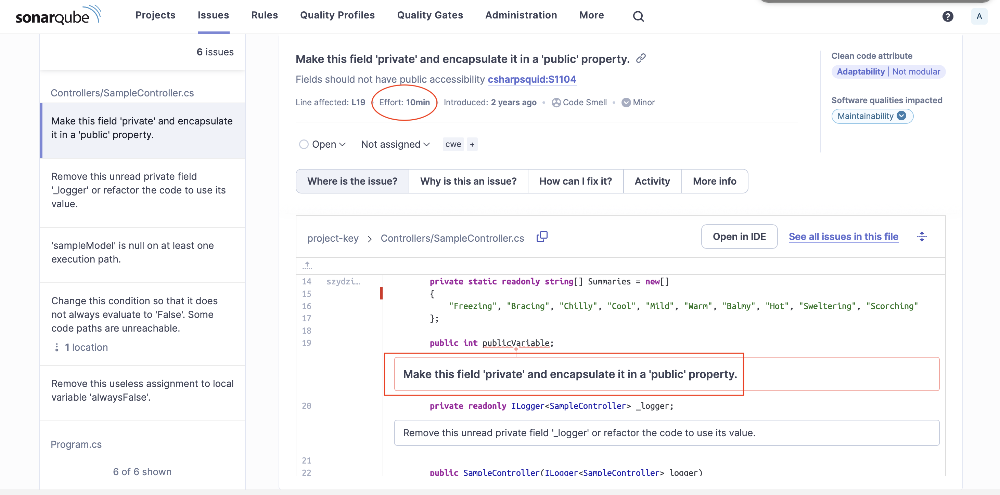

# sonarQube-s3m9

Atividade ponderada de análise estática com sonarqube.

Estudante: Ana Clara Loureiro Muller Zaidan
## Tecnologias utilizadas

- .NET
  - Uma plataforma de desenvolvimento de software criada pela Microsoft, que oferece uma estrutura abrangente para construir uma variedade de aplicativos.
- SonarQube
  - Uma plataforma de código aberto utilizada para avaliar e melhorar a qualidade do código-fonte.
- Docker
  - Uma plataforma de código aberto que permite que os desenvolvedores empacotem, distribuam e executem aplicativos em contêineres.
  
## Conceitos aprendidos

### Utilização do docker para criar e executar contâiner localmente
O Docker é uma plataforma de código aberto que facilita a criação, implantação e execução de aplicativos em contêineres, em que contêineres são unidades de software leves e portáteis que incluem tudo o que é necessário para executar um aplicativo, incluindo código, bibliotecas e outras dependências.

### Análise estática de código
Para realizar a análise estática do código de exemplo - desenvolvido com .NET - na pasta /app, foi utilizado o SonarQube. 

O SonarQube é uma ferramentea que realiza uma revisão de código automática, auxiliando na aplicação de Clean Code ao seu projeto. 

Nesse sentido, o Docker foi utilizado para rodar o SonarQube de forma simples e rápida:
-     docker run -d --name sonarqube -p 9000:9000 -p 9092:9092 sonarqube

Após fazer todo o setup, foi possivel acessar a interface do SonarQube através do localhost, e ter acesso a todas as suas funcionalidades de gerenciamento de código:

Inicialmente, a ferramenta utiliza de padrões de qualidade e métricas default, mas é possivel aplicar diversos niveis de personalização na plataforma, garantindo a melhor abordagem em relação a cada projeto específico.

Logo, ela te da acesso a relatórios detalhados de diversos aspectos do código, como bugs, vulnerabilidades, dívida técnica, cobertura de testes, não só apontando problemas, mas mostrando possiveis soluções e o tempo estimado para aplicá-las, como é visualizado na imagem abaixo:

Claramente, é uma ferramenta inovadora e extremamente útil no desenvolvimento de código de qualidade.
